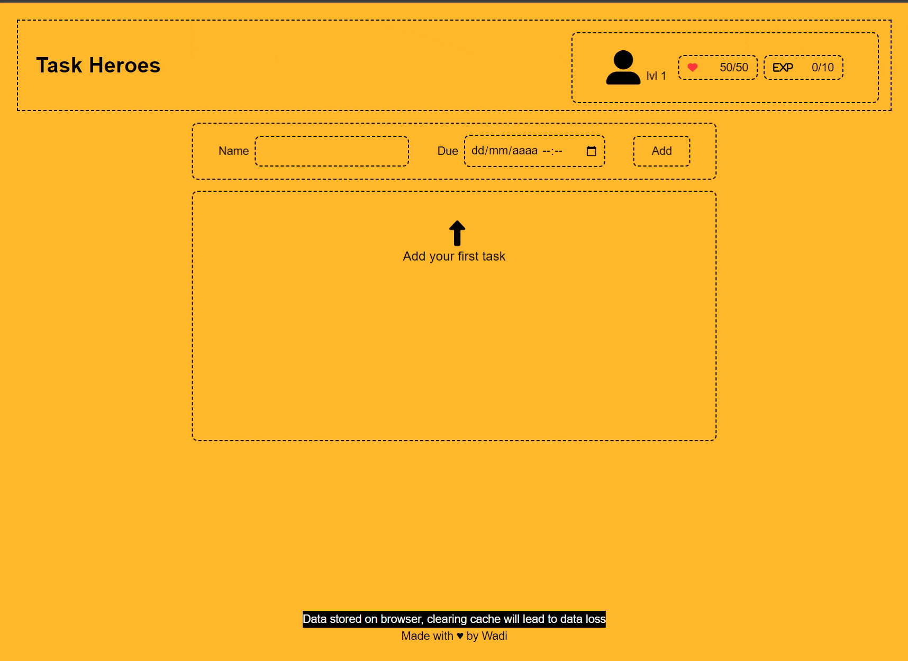

[![MIT License][license-shield]][license-url]

<!-- PROJECT LOGO -->
 

  

  

    Gamified todo app!
     
  

<!-- TABLE OF CONTENTS -->
<!-- 

  
Table of Contents

  <ol>
    <li>
      <a href="#about-the-project">About The Project</a>
      <ul>
        <li><a href="#built-with">Built With</a></li>
      </ul>
    </li>
    <li><a href="#roadmap">Roadmap</a></li>
    <li><a href="#contact">Contact</a></li>
  </ol>

 -->

<!-- ABOUT THE PROJECT -->

## About The Project

Gamified todo app, earn experience with each task you complete, loose HP when you miss a deadline!

(<a href="#readme-top">back to top</a>)

### Built With

[![React][React.js]][React-url]
[![TypeScript][Typescript]][Typescript-url]
[![Vite][Vite.js]][Vite-url]
[![Tailwind][Tailwindcss]][Tailwind-url]

(<a href="#readme-top">back to top</a>)

## Roadmap

- [ ] Talents (think of habits you want to enforce)
- [ ] UI (HP and EXP bars)
- [ ] List ordering and filtering
  - [ ] Drag & drop

(<a href="#readme-top">back to top</a>)

<!-- LICENSE -->

## License

Distributed under the MIT License. See `LICENSE.txt` for more information.

(<a href="#readme-top">back to top</a>)

## Contact

Wadi - [@marianowadi](https://twitter.com/marianowadi)

(<a href="#readme-top">back to top</a>)

[license-shield]: https://img.shields.io/badge/License-MIT-yellow.svg
[license-url]: https://github.com/marianowadi/task-heroes/blob/master/LICENSE
[product-screenshot]: images/screenshot.png
[React.js]: https://img.shields.io/badge/React-blue?logo=react&logoColor=61DAFB
[React-url]: https://reactjs.org/
[Vite-url]: https://vitejs.dev/
[Tailwind-url]: https://tailwindcss.com/
[Typescript-url]: https://www.typescriptlang.org/
[Typescript]: https://img.shields.io/badge/TypeScript-%23007ACC.svg?logo=typescript&logoColor=white
[Vite.js]: https://img.shields.io/badge/Vite-%23646CFF.svg?logo=vite&logoColor=white
[Tailwindcss]: https://img.shields.io/badge/tailwindcss-0F172A?&logo=tailwindcss
